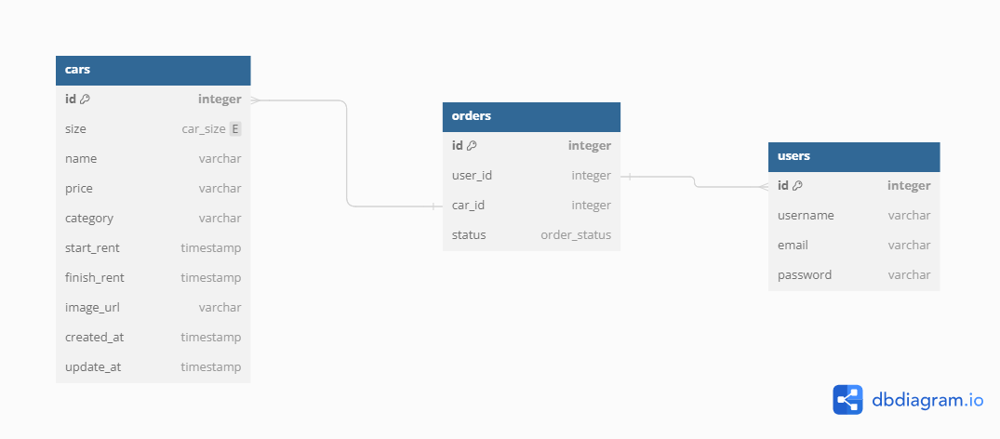

## Binar Car Rental ( API )

## ERD

## API Spec
### Cars API
Method | URI | Description | 
------ | --- | ----------- |
**GET** | `/api/v1/cars` | Display all cars data from database |
**GET** | `/api/v1/cars/:id` | Display specific car data from database by ID |
**POST** | `/api/v1/cars` | Create car data to database |
**UPDATE** | `/api/v1/cars/:id` | Update specific car data from database by ID |
**DELETE** | `/api/v1/cars/:id` | Delete specific car data from database by ID |

### User API ( will release )
Method | URI | Description | 
------ | --- | ----------- |
**GET** | `/api/v1/users` | Display all users data from database |
**GET** | `/api/v1/users/me` | Display specific user data  |
**POST** | `/api/v1/users` | Create user data to database |
**UPDATE** | `/api/v1/users/:id` | Update specific user data from database by ID |
**DELETE** | `/api/v1/users/:id` | Delete specific user data from database by ID |